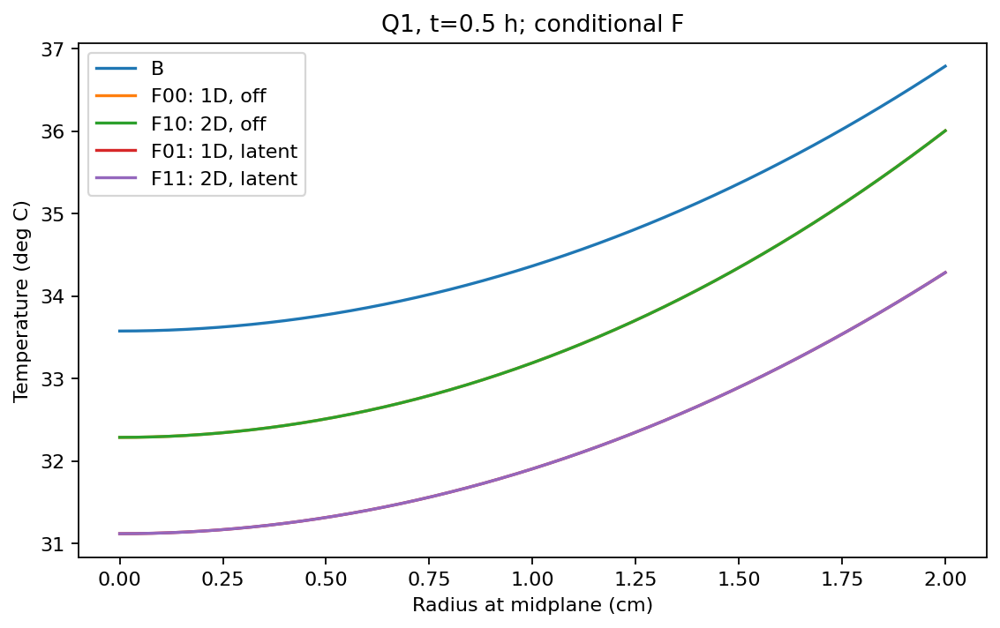
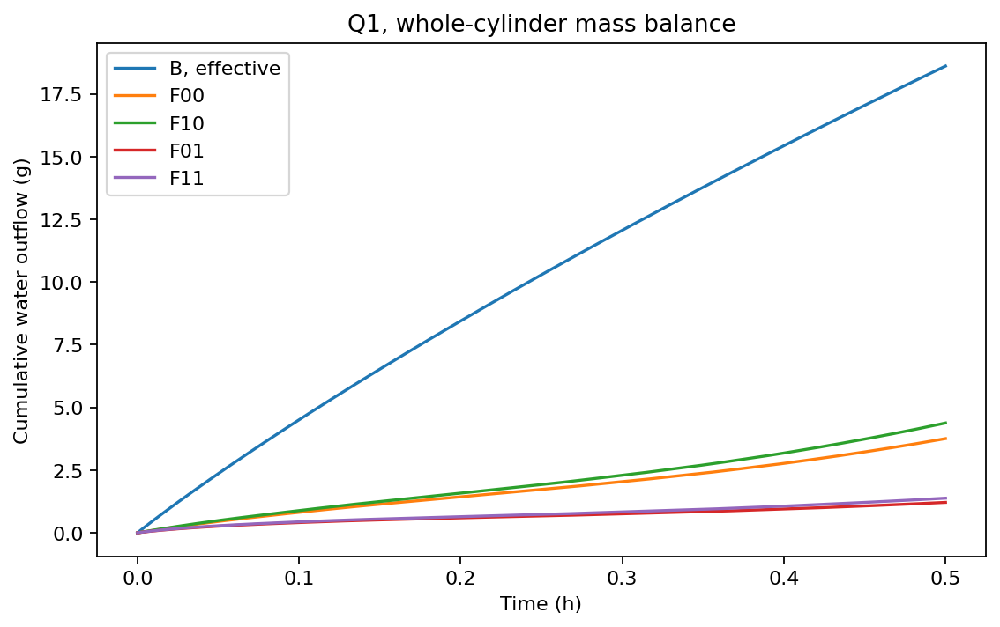
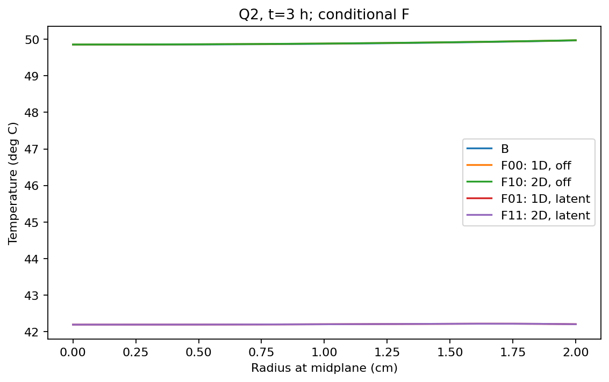
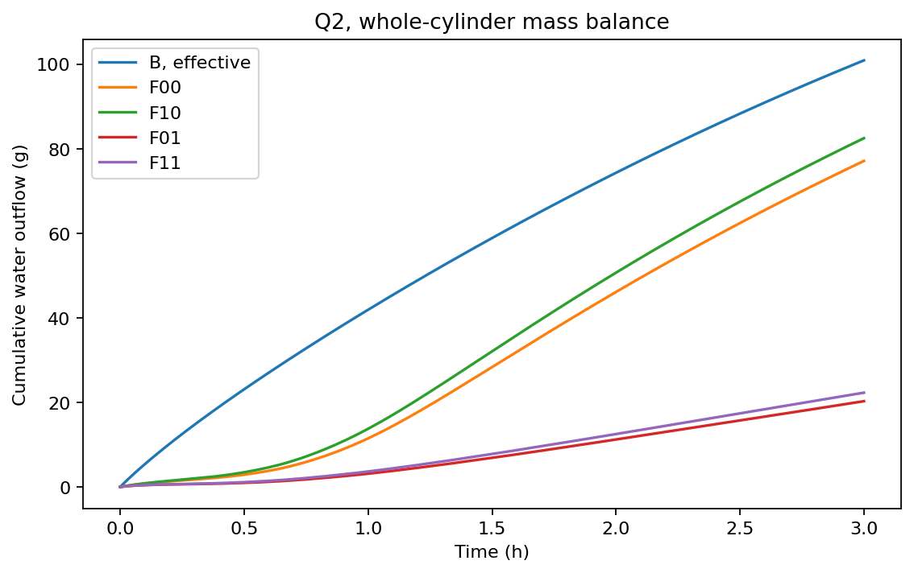
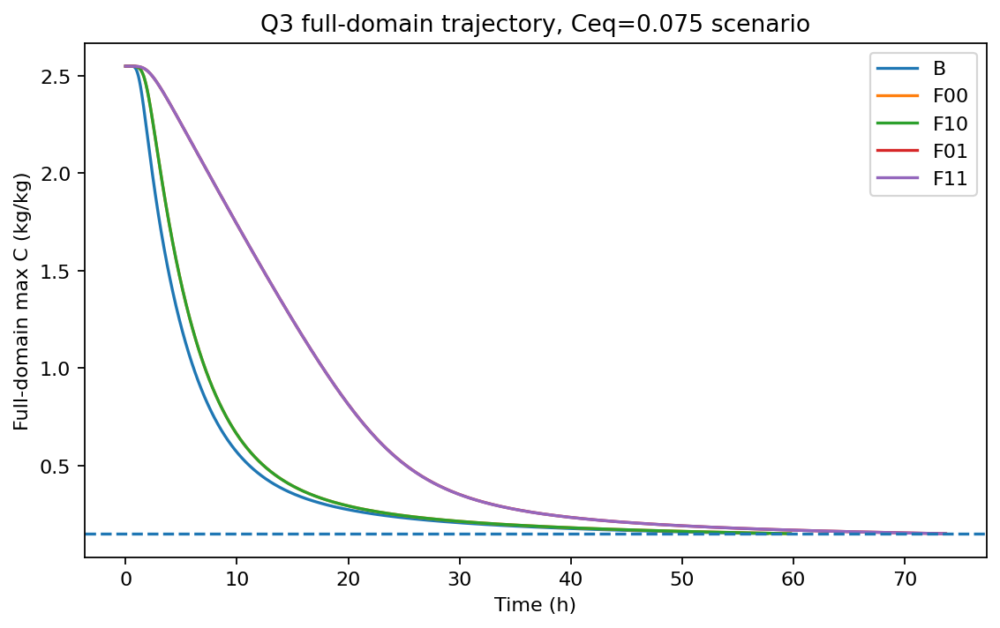
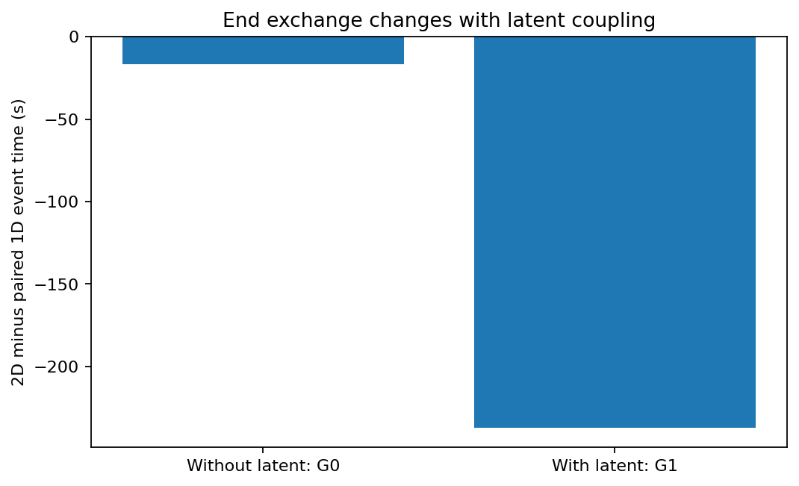

# 前三问二维与潜热影响评估

> 本轮为条件模型的定量选型交付。四组均真实联立积分，原基线、旧论文与官方Excel没有覆盖。下列结果不等于药材参数已被实验识别。

## 1. 比较口径

输入为逐字节核验的仓库环境CSV，0–4h线性插值、之后末小时61点均值。共同模型F采用固定干骨架、组分焓、气固串联阻力和理想活度族；主情景未来平衡C_eq=0.075kg/kg。F的质量、参数及能量方程见《模型推导与假设契约》。

F00/F10关闭潜热，是消融诊断；F01/F11开启同一界面通量对应的潜热。F00→F10、F01→F11分别为两种相变设置下的端面效应；F00→F01、F10→F11为配对潜热效应。交互项I=F11−F10−F01+F00。

B→F00另列为闭合调整：气固映射、串联气膜、固定干密度/容量与携焓均可能变化。尤其Q1的F容量取附录3组分比热，未保留2600常数，不能把B到F的全部差异归于潜热。B失水列是固定参考干密度换算的有效失水，不是已验证的真实干燥量。

Q1/Q2表中的B为本轮按原有效方程新跑的回归解，不是对冻结NPZ逐元素回读。Q3事件表明确引用原正式B；本轮B512回归根为206904.693273秒，与原根约差−1.697秒，不替换原正式值。图中的B也是本轮回归轨迹。

## 2. Q1：1800秒

|组别|中截面轴心T/℃|中截面表面T/℃|轴心C|表面C|累计失水/g|对流输入/kJ|
|---|---|---|---|---|---|---|
|B|33.5753|36.7856|2.5500|1.5102|18.6092|4.8010|
|F00|32.2864|36.0032|2.5500|2.3127|3.7570|5.3316|
|F10|32.2864|36.0032|2.5500|2.3127|4.3797|5.5539|
|F01|31.1191|34.2843|2.5500|2.4803|1.2135|7.0632|
|F11|31.1191|34.2843|2.5500|2.4803|1.3819|7.5827|

端面交换使无潜热组的总体失水增加0.622650g（16.573%），使有潜热组增加0.168373g（13.874%）。有潜热F11的端面净失水为0.124156g，占其全表面净流出的8.984%；这个占比不等于二维与一维的总差。

一维潜热效应F01−F00：中截面轴心温度-1.167344℃，表面温度-1.718897℃；轴心C变化+0.000001，表面C变化+0.167615kg/kg；总体失水减少2.543482g（67.699%）。

F11端面轴心温度为34.286692℃、含水率为2.487363kg/kg；与中截面轴心的差分别为+3.167596℃和-0.062636kg/kg。因此，中截面相近不能外推为端部或整个物体都相近。

F11的模型能量账本：对流输入7.582716kJ=储能增加4.212463kJ+潜热3.357831kJ+净水携焓0.012421kJ（差值为积分残差）。F00虽满足消融方程，但相对于真实相变账本还漏掉9.114295kJ，不能称为真实蒸发能量闭合。

|对照|轴心ΔT/℃|表面ΔC|Δ失水/g|Δ对流/kJ|
|---|---|---|---|---|
|闭合 B→F00|-1.288905|+0.802493|-14.852148|+0.530656|
|G0|-0.000000|-0.000000|+0.622650|+0.222223|
|G1|+0.000000|+0.000000|+0.168373|+0.519498|
|L1|-1.167344|+0.167615|-2.543482|+1.731581|
|L2|-1.167344|+0.167615|-2.997759|+2.028855|
|I|+0.000000|+0.000000|-0.454277|+0.297274|

旧B轨迹上的条件潜热45.5923kJ与对流4.800979kJ之比9.49647，仅诊断旧轨迹能量缺项。新F01同时降低失水和表面温度，因此失水约1.214g、潜热约2.949kJ，对流反而增加至约7.063kJ。不能维持旧18.609g失水只减潜热，也不能以9.5倍推断时长。

## 3. Q2：3小时

|组别|中截面轴心T/℃|中截面表面T/℃|轴心C|表面C|累计失水/g|对流输入/kJ|
|---|---|---|---|---|---|---|
|B|49.8495|49.9664|1.7662|1.0081|100.8780|20.9399|
|F00|49.8546|49.9708|2.0555|1.2602|77.0994|21.8532|
|F10|49.8561|49.9717|2.0555|1.2602|82.4795|21.7882|
|F01|42.1936|42.2046|2.4503|2.1705|20.2796|63.5233|
|F11|42.1936|42.2046|2.4503|2.1705|22.2941|68.3598|

端面交换使无潜热组的总体失水增加5.380174g（6.978%），使有潜热组增加2.014555g（9.934%）。有潜热F11的端面净失水为1.758302g，占其全表面净流出的7.887%；这个占比不等于二维与一维的总差。

一维潜热效应F01−F00：中截面轴心温度-7.660992℃，表面温度-7.766176℃；轴心C变化+0.394756，表面C变化+0.910215kg/kg；总体失水减少56.819788g（73.697%）。

F11端面轴心温度为42.221863℃、含水率为2.126046kg/kg；与中截面轴心的差分别为+0.028284℃和-0.324260kg/kg。因此，中截面相近不能外推为端部或整个物体都相近。

F11的模型能量账本：对流输入68.359760kJ=储能增加13.566357kJ+潜热53.624519kJ+净水携焓1.168879kJ（差值为积分残差）。F00虽满足消融方程，但相对于真实相变账本还漏掉184.359474kJ，不能称为真实蒸发能量闭合。

|对照|轴心ΔT/℃|表面ΔC|Δ失水/g|Δ对流/kJ|
|---|---|---|---|---|
|闭合 B→F00|+0.005073|+0.252116|-23.778611|+0.913370|
|G0|+0.001484|-0.000013|+5.380174|-0.064983|
|G1|+0.000003|-0.000001|+2.014555|+4.836464|
|L1|-7.660992|+0.910215|-56.819788|+41.670065|
|L2|-7.662473|+0.910227|-60.185407|+46.571512|
|I|-0.001481|+0.000012|-3.365619|+4.901447|

## 4. Q3：全域事件、闭合改变与交互

|组别|等号临界/s|等号临界/h|本轮真实续算执行/s|
|---|---|---|---|
|B原正式值（继承）|206906.389932|57.473997|206906.76（旧模型口径）|
|F00|214422.117781|59.561699|215022.117781|
|F10|214405.544391|59.557096|215005.544391|
|F01|264637.766874|73.510491|265237.766874|
|F11|264400.400457|73.444556|265000.400457|

相对于原B，共同闭合调整B→F00为+7515.727849s（+2.087702h）；一维潜热效应为+50215.649092s（+13.948791h），二维潜热效应为+49994.856066s。不能将这些差合并后全部称作潜热效应。

无潜热时端面使临界时间提前16.573390s；有潜热时提前237.366416s，即3.9561分钟、约占一维有潜热时长的0.08969%。交互项I=-220.793026s，说明旧模型的约7.5秒端面影响不能直接沿用到潜热模型。

主情景F11的最大含水率在临界附近位于中截面轴心。根后实际续算600秒，末端全域max C=0.14982902974264486。该执行时间含人为预设数值缓冲，不是最短烘干时间；不含等温线、气膜近似或未来环境的不确定性。

F11在本轮执行端点的全域累计失水为209.782102g；对流输入520.486500kJ、相变耗热503.073912kJ、净水携焓13.692419kJ、储能3.720167kJ。它们与Q1采用不同初始干质量，不在1800秒接续。

## 5. 数值分辨率与验收边界

|nr×nz|无潜热配对端面效应/s|有潜热配对端面效应/s|
|---|---|---|
|24×32|-17.273460|-239.835314|
|48×64|-16.709218|-237.831573|
|96×128|-16.573390|-237.366416|

|问/潜热|单独轴向加密Δ失水/g|单独径向加密Δ失水/g|轴向加密Δt/s|径向加密Δt/s|
|---|---|---|---|---|
|1/0|0.0000433|0.0001960|—|—|
|1/1|0.0000256|0.0000630|—|—|
|23/0|-0.0012980|-0.0025505|0.136064|21.688962|
|23/1|-0.0000180|-0.0000246|0.468358|17.950488|

主1D F01从48→96→192格，临界时间为264619.813184、264637.766874、264642.349085秒；独立H/C状态、单元中心、无储量表面Radau在96→192→384→768单元得到264404.372325、264569.714074、264622.673906、264638.152692秒。两种空间方法从不同边界表示向同一量级收敛，不是只换时间积分器。

同96格主空间离散改用更紧Radau，根为264637.762255秒，与BDF差约0.00462秒。主96格与192格差约4.58秒，独立768格与主192格差约4.20秒。二维配对端面效应48→96格变化约0.465秒；本轮可分辨约237秒和约14小时的效应，但没有秒以下连续PDE误差保证。

作为保守工程数值尺度，取最近两档原始时间差、独立方法差和配对端面变化的最大值，再留安全系数；约数十秒，而不是旧0.03秒。本轮预设600秒续算缓冲明显大于这些观测差，但不称为严格误差上界或真实工艺保证。

|问|端面对照|记录时点中截面最大绝对温差/℃|最大绝对含水率差/kgkg|
|---|---|---|---|
|1|G0|1.8970408e-05|8.1642045e-07|
|1|G1|1.9699719e-05|9.6140061e-07|
|2|G0|0.0019661545|3.4993788e-05|
|2|G1|3.719924e-05|1.2981031e-06|

关闭二维端面交换的真实退化试算，与同径向一维相比仍有约2.84×10⁻⁵℃、8.74×10⁻⁷kg/kg的自适应时间误差。故Q1及Q2有潜热时的极小中截面差不能干净分离为物理端面效应；结论是当前工程分辨率下近似等价，不是严格为零或四位完全相同。

几何选型记录的工程门槛为中截面0.05℃/0.001kg/kg、时长0.1%、整体失水/能量1%。这些是先于最终选型、但在试算后提出的报告标准，并非用户给定或全体运行前预注册。即使换用更严标准，报告保留原始差值，不按是否过线隐藏变化。

主要四组的干质量漂移为零；独立重构几何权重、储量和表面积分已核对。主算例最大归一化水质量残差为1.39e-06，能量残差为3.06e-07；另一时间网格Simpson后处理的最大归一化能量残差为0.000122，均低于运行前代码写入的2×10⁻⁵/2×10⁻³阈值。

## 6. 可达性及参数依赖

|假设C_eq|二维网格|等号临界/h|已积分末端max C|
|---|---|---|---|
|0.05|32×48|71.3375|0.149825440|
|0.075|96×128|73.444556|0.149829030|
|0.12|32×48|85.1105|0.149880269|
|0.2|32×48|240h无下穿|0.200000300|

0.05与0.12是较粗的敏感性算例，不冒充主网格精度。0.05的一维32→48格时长变化约0.046小时，因此更适合报告“约71小时”，不是稳定四位时长；0.12约85小时。趋势显著大于数值差，但不能把这三个时间当实验置信区间。

0.20情景始终开启全域事件检查，实际计算到240h未出现下穿，最终max C约0.2000003；它同时具有高于阈值的长期平衡。未仅凭稳态值排除瞬态，未伪造结束末行。这足以说明现有材料不能识别唯一真实时长或保证0.15必可达。

|气膜K_p倍数（其他不变，1D48格）|临界/h|
|---|---|
|0.5|76.212092|
|1.0|73.505504|
|2.0|72.145435|

## 7. 最终选型结论

Q1、Q2的规定径向表及机理分析推荐一维有潜热共同模型；总体水分、能量与端部状态另保留二维结果。Q3推荐用二维有潜热模型作最终全域事件判定，用一维作趋势与参数扫描。主情景中一维晚约4分钟，可作该情景的保守近似，但不能未经验证推广到其他气固参数。

潜热不是可删的小项。固定干骨架路线能保持质量账本闭合，但须放弃经验ρ为动态真实湿密度的解释；Q1容量与部分焓仍需明确额外假设。旧B及正式表不被本轮条件情景自动替换，不将73.4446h写成无条件真实答案。

论文可按“二维一般守恒模型—端面/潜热四组对照—限定指标的降维验证—一维径向机理—二维全域终判—可达性与参数局限”组织。不能用中截面差小，证明整个药材的总失水或热量差也小。

## 8. 证据边界与未完成项

本轮输入CSV已经逐字节核验，四组、参数情景、收敛和独立PDE均有新运行数据。原XLSX、冻结NPZ没有完成二进制逐元素复核，原PDF页图未完成视觉逐式核查；实际使用的原文页提取文本、出版社HTML及失败日志在来源清单中明确区分。没有声称重新验收整个历史仓库。

早期Q1误写D0的试算、两份超时作业、一次二维内存终止以及独立细网格初始Jacobian问题均已隔离并保留记录。最终Q1均用核对后的7×10⁻⁹从初态重算；失败或合成测试不作为物理结果。官方Excel、全文定稿和实验参数识别不是本轮已完成项。

原文对应：Adrover等2020，PDF物理第5–6页式(5)–(13)，支持气固映射和表面相变耦合结构；da Silva等2014，第3–5页式(1)–(2)、(8)–(10)、(17)–(18)，支持圆柱权重、材料平衡量与干质量账本。实际读取的是仓库原文页提取文本及已访问的出版社HTML，未声称完成PDF页图视觉逐式核验。详见《参数与文献证据表》。
