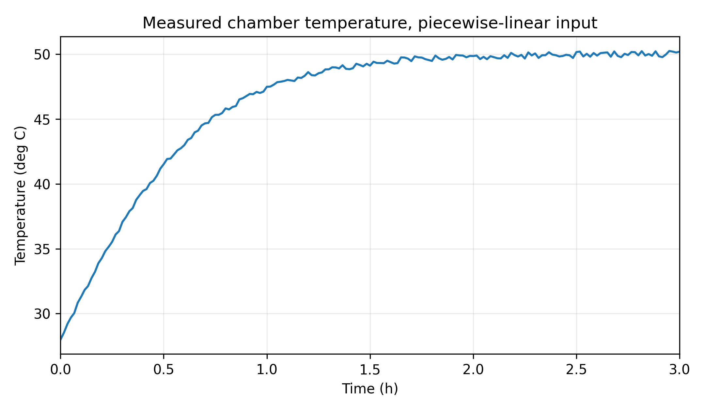
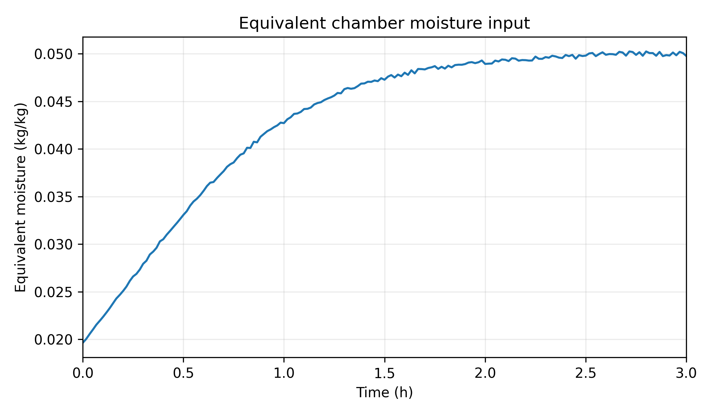
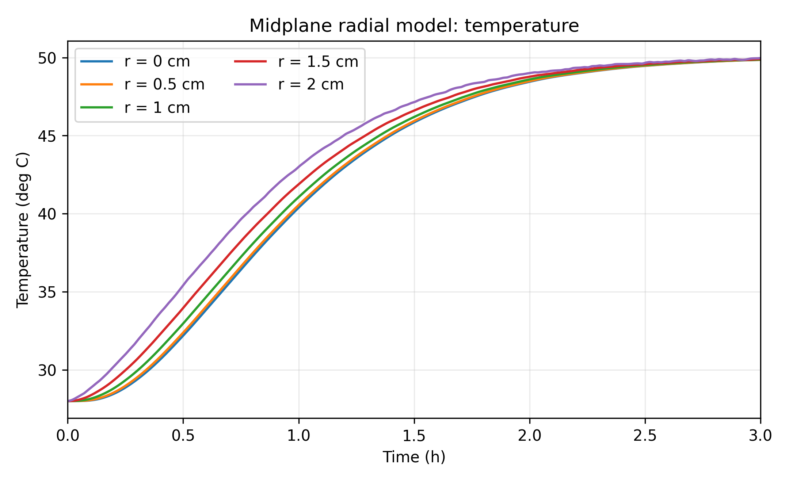
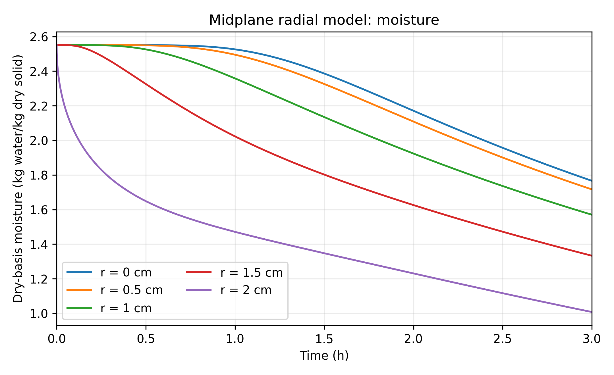
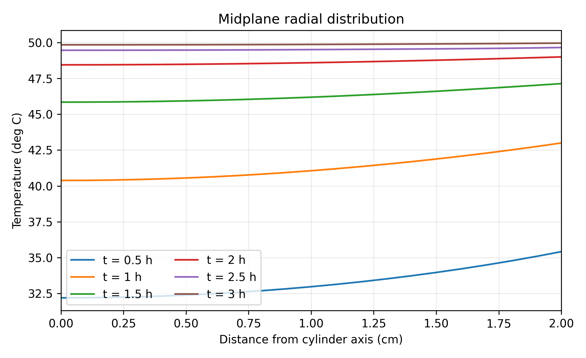
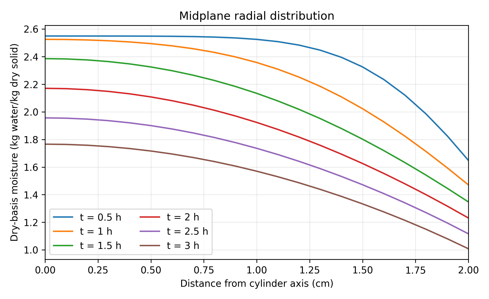
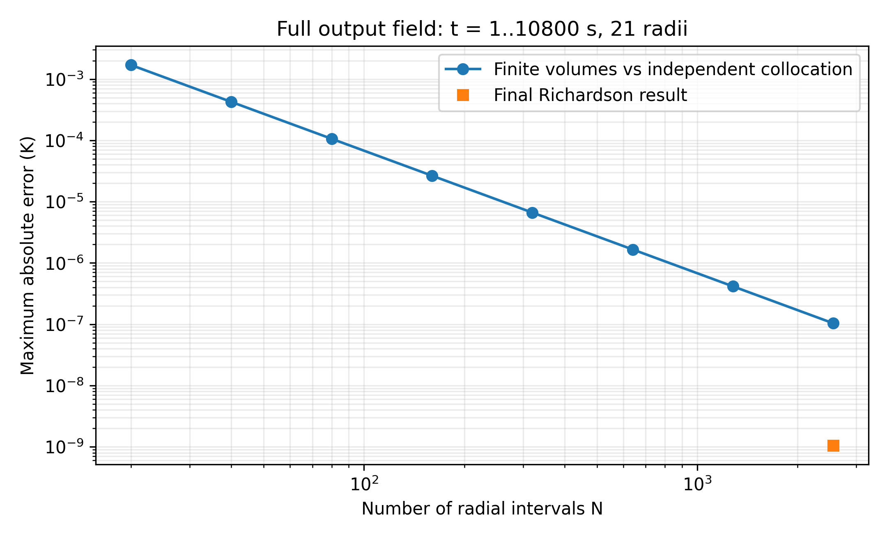
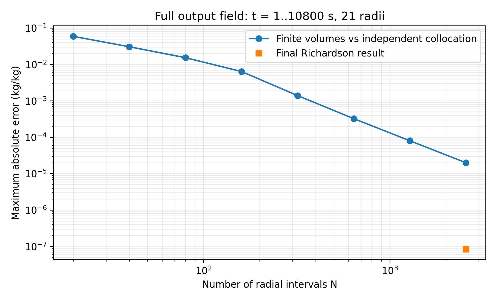
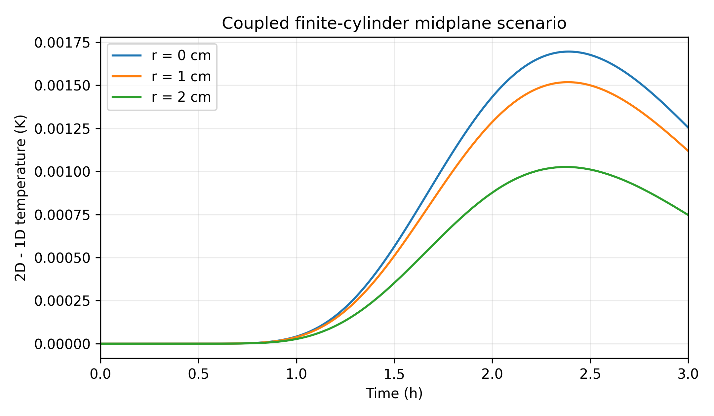
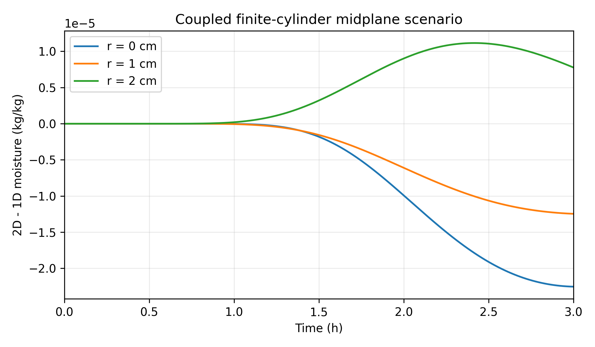

# 第二问：变热容量与局部双向耦合下的药材径向热质传输

> 队伍逐项审阅稿。正文数字由本次真实数值解及检验记录生成，不采用上传预计算作标准答案。第一问代码、论文及结果保持原样。本模型为题给经验物性下的有效模型，不是完整气固相变与收缩混合物模型。

## 1 问题分析与输出范围

第二问要求统一采用附录3，描述预热和恒温阶段的温度及干基含水率，并给出前3 h每隔0.5 h、径向每隔0.5 cm的两张表。初始条件仍为28 ℃和2.55 kg/kg，从初始时刻重新求解，不接续第一问1800 s末态。[1]

题面及模板没有明文规定第二问逐秒Excel的终点。本次采用“规定的前3 h完整采样轨迹”解释：正式result2.xlsx含1—10800 s及0—2 cm的21个位置。0 s保留在未舍入数组中；不宣称这等于已求得数天全过程或达标时刻。

内部程序可以指定更长终点，但超出附件1的4 h范围时默认报错。显式选择末值保持才允许延伸，并记录该外推假设。题目背景“2—3天”不作为数值终点，也没有把第三问0.15 kg/kg阈值偷换为第二问原文条件。

## 2 原始数据与证据

本次通过GitHub连接实际核对main为1942d7506632e94853b32772c7c9bb4ba3a3c0be，与上传包说明一致。主说明与未推送的本地核验使用上传包版本；路径、读取层级、哈希和访问失败记录见../evidence/source_access.md。

GitHub文本接口不能提供PDF二进制，下载尝试也未成功。本次使用上传包中实际PDF/XLSX字节，其Git blob哈希与远端原件记录一致。已经直接查看原题第2页及第4页附录3公式图像，未把提取文本或LFS指针冒充原PDF全文。

附件1的Sheet1含241个原始记录，时间0—14400 s、间隔60 s；前3 h含181个原始点。全表无缺失、重复或非有限值，列含义为时间、烘房温度和环境水分量。附件是边界输入，不能用其拟合优度代替内部响应验证。

主输入采用逐段线性插值，并在每个60 s拐点重启时间积分。末段小幅波动原样保留，不把初始环境改为恒定50 ℃。所有前3 h结果完全在实测区间内，不受4 h之后外推选择影响。

## 3 假设与符号

将药材作为均匀、有效各向同性的连续介质，固体和水分共用局部温度。按分问安排，第二问采用固定半径0.02 m和长度0.25 m，不引入第四问收缩数据。材料骨架整体速度取零，输出对应轴向中截面到轴线的径向距离。

附录3的密度、比热和导热系数按当地含水率更新，扩散系数按当地温度和含水率更新。热容量组合S(C)=ρ(C)cp(C)解释为有效温度方程的容量系数，不同时宣称经验密度精确满足固定体积湿混合物的真实质量组成关系。

继承hT=25 W/(m²·K)、hm=8×10⁻⁷ m/s，作为附录3未另列交换系数时的明确假设。环境及交换系数在侧面均匀，外界时间序列已知；不另求烘房流动、装载反馈、托盘接触、辐射或内部化学热源。

环境“水分浓度”记为y∞，进入固相Robin边界的量记为b(t)。本问取等效映射b=y∞，不声称药材干基含水率、空气湿度比和相对湿度同义。未给出的解吸等温线、压力与系数基准不从其他食品移植。[2,3]

主模型不显式计入蒸发潜热及迁移水分携带的显热。此为有效模型的适用限制，不以“处于预热”或“未给潜热”证明该机制足够小。严格扩展须共同闭合界面平衡、真实质量通量和能量输运，不能单独添加不相容的潜热项。

| 符号 | 定义 | 单位或数值 |
|---|---|---|
| r，t | 径向坐标、时间 | m，s |
| R，L | 固定半径、长度 | 0.02 m，0.25 m |
| T，TK | 摄氏温度、绝对温度TK=T+273.15 | ℃，K |
| C | kg水/kg干物质 | kg/kg |
| T∞，b | 烘房温度、等效边界含水率尺度 | 附件1插值 |
| ρ，cp，k，D | 题给经验物性 | 见式(1) |
| S=ρcp | 有效体积热容量 | J/(m³·K) |
| ρd,ref | 固定参考干物质密度，仅用于解释有效水分守恒 | kg干物质/m³ |
| hT，hm | 继承的侧面对流交换系数 | 25 W/(m²·K)，8×10⁻⁷ m/s |

## 4 独立审查变容量和质量基准

### 4.1 经验物性与局部耦合

原题第4页附录3经图像核对，使用：

\[
\begin{aligned}
\rho(C)&=650+128C,\\
c_p(C)&=1450+2736\frac{C}{1+C},\\
k(C)&=0.21+0.38\frac{C}{1+C},\\
D(T_K,C)&=2.4\times10^{-3}\exp(-0.45/C)\exp(-3850/T_K).
\end{aligned}\tag{1}
\]

温度升高通过D促进水分扩散；失水又改变S及k，反馈温度响应。因此本问即使没有显式潜热，仍存在局部双向耦合。程序在每次非线性残差和Jacobian计算中更新全部节点的物性，不先冻结完整温度史后再计算水分。

### 4.2 为什么不直接改为乘积的时间导数

\[
\partial_t[S(C)(T-T_{ref})]
=S(C)T_t+S'(C)(T-T_{ref})C_t.\tag{2}
\]

式(2)新增项不是题给热源。只知道固定组成的比热，并不足以确定组成变化时的总焓、参考状态及迁移组分的携焓通量。没有这些配套关系，改写为乘积导数可能引入参考温标依赖，而不是自动变得更守恒。[4]

Adrover等在PDF第6页式(9)确实采用含ρcpT乘积的守恒式，但同时具有固体收缩速度、体积水分变量和相变边界。本文没有把该式判为错误；拒绝的是只抽取其储存项、删去配套机制后直接移入本题的做法。[3]

本次选择S(C)Tt作为闭合的有效温度模型；另以“均匀温度、非均匀水分、绝热无质通量”检验其温度保持性质，并分别用摄氏和开尔文状态完成积分。此检验确认实现的温标等价性，不宣称所有真实混合物能量机制均已验证。

### 4.3 干基与变密度不能混用

若将经验ρ解释为真实湿体密度，则ρd(C)=ρ/(1+C)=(650+128C)/(1+C)，且ρd′=-522/(1+C)²。失水时该干密度增大，与“固定体积、静止骨架、不产生干物质”不能同时作为精确物理关系成立。

本问把经验ρcp仅用于有效热容量；质量方程采用固定参考干密度可约去的有效扩散式。对任意固定ρd,ref，令jw=-ρd,ref D∇C，便有∂t(ρd,ref C)+∇·jw=0。该意义下体积加权C积分可守恒，但不能用ρ(C)C冒充真实水质量。

| 候选模型 | 必需补充 | 本次裁定 |
|---|---|---|
| S(C)Tt＋干基有效扩散 | 声明有效物性、参考干密度与等效边界 | 正式条件性基线 |
| 仅把左侧改成∂t(ST) | 组成焓、参考状态、组分携焓与质量运动关系 | 不作无闭合替换 |
| 坚持经验ρ为真实密度 | 干物质守恒、骨架速度、几何运动和边界 | 本问信息不足以唯一确定 |
| 固定ρd后改写ρ=ρd(1+C) | 更改题给经验密度的理由与独立响应数据 | 仅可作为另立情景，不暗改主答案 |

## 5 控制方程、初始与边界条件

在前述假设下，能量和水分的有效传输方程为：

\[
\boxed{S(C)\,T_t=\frac1r\partial_r\!\left[rk(C)T_r\right]},
\qquad
\boxed{C_t=\frac1r\partial_r\!\left[rD(T_K,C)C_r\right]}.
\tag{3}
\]

\[
T(r,0)=28\,{}^\circ\mathrm C,\quad C(r,0)=2.55,
\qquad T_r(0,t)=C_r(0,t)=0.\tag{4}
\]

\[
-k(C_s)T_r(R,t)=h_T(T_s-T_\infty),\qquad
-D(T_{s,K},C_s)C_r(R,t)=h_m(C_s-b).\tag{5}
\]

外法向取+r，升温阶段负的向外热通量表示热量进入药材；Cs>b时水分通量向外。均匀初始C与t=0的Robin水分边界在角点不相容，允许随t>0形成初始边界层，不擅自修改题给初态或把表面值直接设为环境值。

导热系数和扩散系数必须留在散度内。特别地，S⁻¹∇·(k∇T)一般不等于∇·[(k/S)∇T]；将变热扩散率直接放到面上会引入错误项。程序使用面上k形成热通量，再除当地S，水分通量使用当地T、C更新后的D。

## 6 数值离散和求解

### 6.1 节点中心有限体积

令ri=iΔr，i=0,…,N，Δr=R/N。界面为相邻节点中点及0、R，权重 $w_i=(r_{i+1/2}^2-r_{i-1/2}^2)/2$；实际体积为2πLwi、界面面积为2πLri+1/2。轴心和表面都是真实节点，不用外层单元中心冒充边界值。

\[
Q_{i+1/2}=r_{i+1/2}k_{i+1/2}\frac{T_i-T_{i+1}}{\Delta r},\quad
J_{i+1/2}=r_{i+1/2}D_{i+1/2}\frac{C_i-C_{i+1}}{\Delta r},\tag{6}
\]
\[
w_iS(C_i)\dot T_i=Q_{i-1/2}-Q_{i+1/2},\quad
w_i\dot C_i=J_{i-1/2}-J_{i+1/2}.\tag{7}
\]

面系数采用调和平均2aiaj/(ai+aj)。中心体具有w0=Δr²/8，第一界面r1/2=Δr/2，故常系数中心格式出现圆柱系数4，而非平板系数2，也无需在r=0直接除零。表面控制体保留其储存量，并直接以式(5)提供外通量。[2]

### 6.2 联立隐式推进与外推

状态按T0,C0,T1,C1,…交错排列，以BDF联立积分，使用包含热容量导数及热质交叉项的解析稀疏块Jacobian。主积分rtol=2×10⁻¹²，温度/含水率atol分别为2×10⁻¹³与2×10⁻¹⁴，最大步长10 s。[5]

每段初始试探步长取min(10⁻³ s,0.05Δr²/(2×10⁻⁸),段长)。BDF内部Newton不收敛时按实现缩步；未成功的积分、非有限状态或非正含水率直接报错，不把负浓度静默夹成零。具体函数调用次数和停止状态逐例保存。

内部网格与输出网格分开。实际计算N=20、40、80、160、320、640、1280、2560；输出半径恰为所有主网格节点。为消除主要二阶空间误差，正式未舍入输出采用Richardson值：

\[
u_R=\frac{4u_{2560}-u_{1280}}3.\tag{8}
\]

式(8)不是对环境或示例数值的插值，而是同一非线性PDE两组真实数值解的误差外推。另比较640/1280组成的外推解，并以独立192阶配点解核验。守恒检查针对原有限体积轨迹，不能把后处理外推虚称为新的严格守恒积分器。

### 6.3 独立参考

另取x=(r/R)²，用Chebyshev–Lobatto节点、谱微分及重心插值实现独立空间离散。轴心算子为4/R²[kTx+x∂x(kTx)]/S及对应水分形式。表面Ts、Cs通过耦合非线性Robin条件消元，沿正的连续分支求根。

参考程序独立编写物性代数及Jacobian，没有调用有限体积通量函数。128与192阶的参考解相互收敛；两者仍都采用BDF，故空间实现独立，不夸称时间算法也完全独立。时间误差另由固定网格加严容差及缩小最大步长检验。

## 7 论文结果表及规律

### 表3　3小时内药材中截面温度（℃）

| 时间/h | 0 cm | 0.5 cm | 1 cm | 1.5 cm | 2 cm |
|---:|---:|---:|---:|---:|---:|
| 0.5 | 32.1892 | 32.3821 | 32.9659 | 33.9608 | 35.4130 |
| 1.0 | 40.3816 | 40.5536 | 41.0605 | 41.8782 | 42.9976 |
| 1.5 | 45.8468 | 45.9348 | 46.1930 | 46.6051 | 47.1400 |
| 2.0 | 48.4502 | 48.4881 | 48.5984 | 48.7736 | 49.0033 |
| 2.5 | 49.4670 | 49.4792 | 49.5136 | 49.5653 | 49.6609 |
| 3.0 | 49.8495 | 49.8553 | 49.8746 | 49.9101 | 49.9664 |

### 表4　3小时内药材中截面干基含水率（kg水/kg干物质）

| 时间/h | 0 cm | 0.5 cm | 1 cm | 1.5 cm | 2 cm |
|---:|---:|---:|---:|---:|---:|
| 0.5 | 2.5499 | 2.5489 | 2.5256 | 2.3257 | 1.6486 |
| 1.0 | 2.5257 | 2.4948 | 2.3578 | 2.0230 | 1.4711 |
| 1.5 | 2.3861 | 2.3256 | 2.1344 | 1.8020 | 1.3476 |
| 2.0 | 2.1709 | 2.1084 | 1.9236 | 1.6259 | 1.2311 |
| 2.5 | 1.9566 | 1.9006 | 1.7360 | 1.4720 | 1.1166 |
| 3.0 | 1.7662 | 1.7165 | 1.5702 | 1.3333 | 1.0081 |

3 h时，中心/表面温度为49.8495/49.9664 ℃，中心/表面含水率为1.7662/1.0081 kg/kg。截面按rdr加权的平均温度为49.9043 ℃、平均含水率为1.3825 kg/kg，不能用21个半径节点的算术平均代替。

平均含水率较初态下降约45.7833%，该数值是固定参考干密度下的有效水分减少比例，不是依据变密度计算的实测失重比例。中心与表面仍有明显水分梯度；温度则已接近烘房环境，不能据此把含水率也视为空间均匀。

0.5 h的第二问结果与第一问不同，是从t=0使用不同物性造成的正常差异，而非衔接失败。附录3初始体积热容量较第一问更大；随着升温，D受到温度促进和失水抑制的竞争影响，因此不能简单冻结为初始扩散系数。

## 8 实际验证

### 8.1 量纲、尺度和不变量

初态α0=1.4482817×10⁻⁷ m²/s、D0=5.6416804×10⁻⁹ m²/s。以R为特征长度的BiT、BiC分别为1.0353和2.8360；R²/α0约2761.89 s，R²/D0约70900.86 s。因此不采用整体均匀温度或均匀水分的集中参数近似。

初始场、有限性及非负性检查通过。当前时刻环境下降时，表面可因热滞后略高于当时环境，不能用T≤T∞(t)作错误的逐时硬约束。本次最大超出当时环境约0.0865 K，仍处于整个输入温度包络内。

无外部驱动时均匀场实际积分保持不变。绝热无水分通量、非均匀含水率重新分布测试中，温度保持35 ℃，加权平均含水率漂移2.2204e-15 kg/kg。冻结物性算例与圆柱Bessel解析解比较，最大温度/水分差为4.5013e-10 K/1.7138e-11 kg/kg。

摄氏与开尔文状态分别完成3 h积分，最大温差9.0391e-10 K、含水率差1.0722e-11 kg/kg。故实现中的绝对温标转换与有效容量模型相容。该测试不替代完整物理焓模型的参考态检查。

### 8.2 收支检查

有效水分守恒量是2/R²∫rCdr。独立计算边界通量时间积分后，与该平均值的变化比较，最大残差为6.5066e-12 kg/kg。若乘常数参考干密度和固定体积，才能转为对应的有效水质量残差。

热收支核验的是∫dt∫VS(C)TtdV，而不是末初∫VSTdV之差。对每个已接受的BDF步，独立求连续输出多项式导数，以6点Gauss积分计算储存率并与表面热流比较；归一化残差2.0729e-03 J/m³，相对残差3.1100e-11。

这种收支检查支持式(3)与离散实现相符，不等于证明实际药材的全部显热、组成焓及蒸发能量守恒。细网格快照的四阶单边表面导数还检验了Robin方向与残差，指标另见validation.json。

### 8.3 空间和时间收敛

下表为各有限体积网格与独立192阶参考在全部逐秒输出场中的最大差。最早1 s的水分边界层控制粗网格误差，不能仅看0.5 h以后的论文表来宣布全表已收敛。

| N | Δr/cm | 温度最大差/K | 含水率最大差/(kg/kg) |
|---:|---:|---:|---:|
| 20 | 0.1 | 1.695893e-03 | 5.907922e-02 |
| 40 | 0.05 | 4.242335e-04 | 3.056388e-02 |
| 80 | 0.025 | 1.060647e-04 | 1.533470e-02 |
| 160 | 0.0125 | 2.651596e-05 | 6.366130e-03 |
| 320 | 0.00625 | 6.628770e-06 | 1.390957e-03 |
| 640 | 0.003125 | 1.657005e-06 | 3.237709e-04 |
| 1280 | 0.0015625 | 4.140701e-07 | 7.986541e-05 |
| 2560 | 0.00078125 | 1.033276e-07 | 1.990277e-05 |

固定N=1280，将相对和绝对容差减半、最大步长由10 s减至5 s，最大温差7.6286e-10 K、含水率差7.1370e-11 kg/kg。该对照没有改变空间网格，因而与空间误差分开报告。

最终Richardson场与独立参考的全场最大温差1.0482e-09 K，最大含水率差8.4771e-08 kg/kg。两张论文表及全部453600个正式输出按实际四位小数格式一致；相邻两级Richardson场与128/192阶参考也分别四位一致。

个别值接近十进制舍入边界，例如1.5 h表面温度为47.1400499… ℃，正式显示47.1400 ℃。所以验收采用实际十进制格式逐值比较，而不是仅凭“最大误差小于半个末位单位”推断所有舍入都相同。

### 8.4 错误注入测试

实际测试能够识别四种错误：把摄氏温度直接代入指数、在面上平均α代替k、冻结D导致温度到水分的耦合消失，以及没有配套焓输运时直接改写乘积储存项。这些为物性和残差层的隔离检查，不是四个错误模型的长时积分；错误路径从未用于生成正式result2.xlsx。

两个主实现的解析Jacobian还分别通过复步长方向微分核对。验证开发中曾有预期常数抄写与JSON标量类型错误，均修正后重跑通过；被时间或资源限制中断的额外试验不记为通过，详见运行限制记录。

## 9 几何近似和敏感性

### 9.1 重新验证3 h端部效应

3 h的初态热扩散长度约3.955 cm、初态水分扩散长度约0.781 cm。第一问1800 s的端部误差不能直接延用，因此本次实际求解了r—z二维轴对称、局部双向耦合的有限圆柱情景，侧面和端面采用相同交换系数。

二维与一维在相同径向网格上配对比较，中截面最大温差约1.6954e-03 K、含水率差约2.2530e-05 kg/kg（径向×半轴向区间数 40x80）。这支持中截面径向基线在本时段的工程近似，但不能保证忽略端部后仍保持四位小数不变，也不是严格误差上界。

几何对照同时区分全体积平均与中截面平均。端面局部含水率与侧面中点不同，不能将一维结果称为所有轴向位置的场。二维计算未模拟托盘周向接触、材料收缩或外部风场，不能据此宣布完整真实烘干模型已验证。

### 9.2 交换系数与输入插值

以下为相同N=320的确定性情景，而不是由实验估计的置信区间。每个情景均重新联立求解，包含当地物性反馈；对单一参数的扰动不混入别问物性或收缩数据。

| 情景 | 3h中心T/℃ | 表面T/℃ | 中心C | 表面C |
|---|---:|---:|---:|---:|
| hT降低20% | 49.7203 | 49.8653 | 1.7766 | 1.0096 |
| hT增加20% | 49.9072 | 50.0130 | 1.7596 | 1.0067 |
| hm降低20% | 49.8369 | 49.9561 | 1.8581 | 1.1775 |
| hm增加20% | 49.8595 | 49.9747 | 1.6921 | 0.8737 |
| PCHIP替代线性 | 49.8494 | 49.9666 | 1.7662 | 1.0081 |
| 全部物性冻结在初态 | 49.7351 | 49.8769 | 2.1642 | 0.8655 |

线性与PCHIP输入的最大温差为0.005715 K、含水率差为1.6474e-05 kg/kg。扰动hT或hm引起的变化明显大于数值误差；冻结全部初态物性也会显著改变水分分布。这说明应优先审查物性和边界口径，而不是继续无目的地加密网格。

## 10 结果导出、可复现性与局限

正式工作簿只含“温度”“水分浓度”两张表。每表A2:A10801为1—10800 s，B1:V1为0—2 cm共21个位置，B2:V10801为226800个数值结果，显示0.0000；没有省略号、空缺或非有限数值。

计算过程不提前舍入。q2_unrounded.npz和17位有效数字CSV保留0 s；论文表与Excel从同一数组按四位小数生成。独立OOXML读取审计逐格核对类型、时间、半径、端点、格式及数值，最终结果以excel_audit.json记录为准。

完整源程序按输入读取、有限体积、独立谱法、二维情景、验证、导出和报告分模块保存。运行入口默认输出新目录并保护原始输入与第一问。数值库版本、参数、步长、容差、失败记录及实际复现范围独立记录，不用历史审核代替本次验证。

本次没有内部温湿度或失重实测响应，不能给出实验预测误差。有效密度、界面映射、潜热、辐射、接触及固定几何仍存在模型简化误差。四位小数是题目格式与模型内数值稳定性，不是这些物理选择具有四位精度的证据。

## 参考文献与实际阅读层级

[1] 2026年全国大学生数学建模竞赛A题《药材的烘干问题》，第2页第二问，第3页附录1，第4页附录3。实际读取上传同哈希PDF并查看第2、4页图像；原附件1及result2模板实际按OOXML读取。

[2] da Silva W P, e Silva C M D P S, Gama F J A. Estimation of thermo-physical properties of products with cylindrical shape during drying: The coupling between mass and heat. Journal of Food Engineering, 2014,141:65–73. DOI:10.1016/j.jfoodeng.2014.05.010。实际读取仓库PDF物理页4的完整提取文本（§2.2.3—2.3，式9、10、14相关说明）及出版社摘要；未取得全文PDF二进制，不凭乱码逐式抄录。

[3] Adrover A, Venditti C, Brasiello A. A Non-Isothermal Moving-Boundary Model for Continuous and Intermittent Drying of Pears. Foods,2020,9:1577. DOI:10.3390/foods9111577。实际读取仓库第6页文本，并查看上传原页图像（§3.2式8—14），核对守恒乘积、收缩速度、气固边界和潜热共同存在。未声称本轮通读22页PDF。

[4] COMSOL. Heat Transfer Module Theory: Thermodynamic Properties与The Heat Balance Equation。实际读取官方理论网页，支持比热、焓参考态与物质/能量输运需共同定义。https://doc.comsol.com/6.3/doc/com.comsol.help.heat/heat_ug_theory.07.003.html 及 heat_ug_theory.07.005.html。本文对有效模型的选择和式(2)代数推导为独立判断，不借厂商文档宣称参数已实测。

[5] SciPy. scipy.integrate.BDF official documentation。实际读取官方算法与rtol、atol、Jacobian说明；具体运行版本见validation.json。https://docs.scipy.org/doc/scipy/reference/generated/scipy.integrate.BDF.html 。

## AI参与与人工审阅说明（供队伍完善，不作为已完成人审的证明）

本稿的模型比较、程序实现、计算验证、表格及文字由AI辅助完成。队伍应逐项复核题意、有效密度及界面假设、输出时域和数值证据，并如实记录采纳与修改内容；本文件不把尚未完成的人工审查写成已完成。
