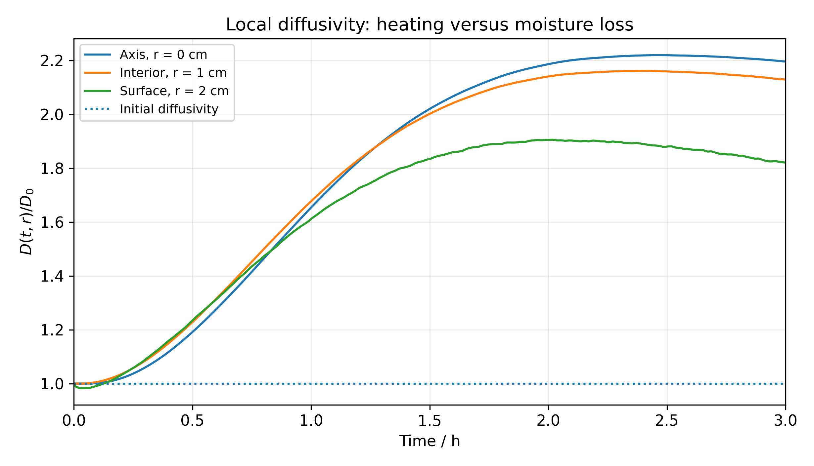
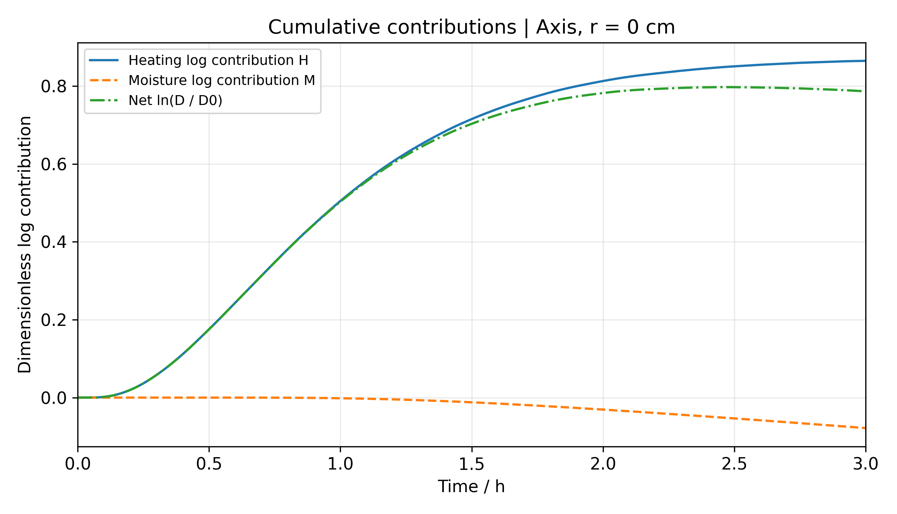
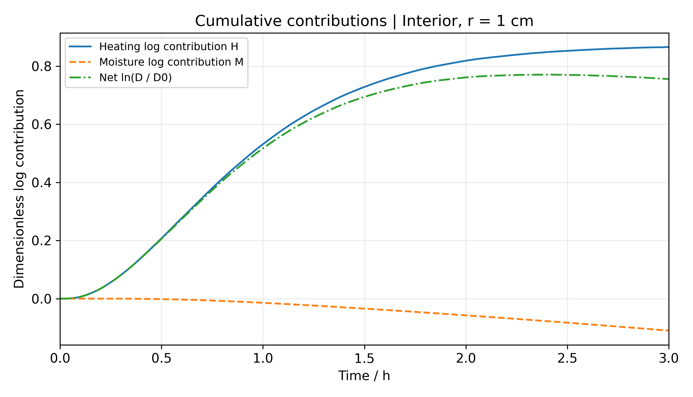
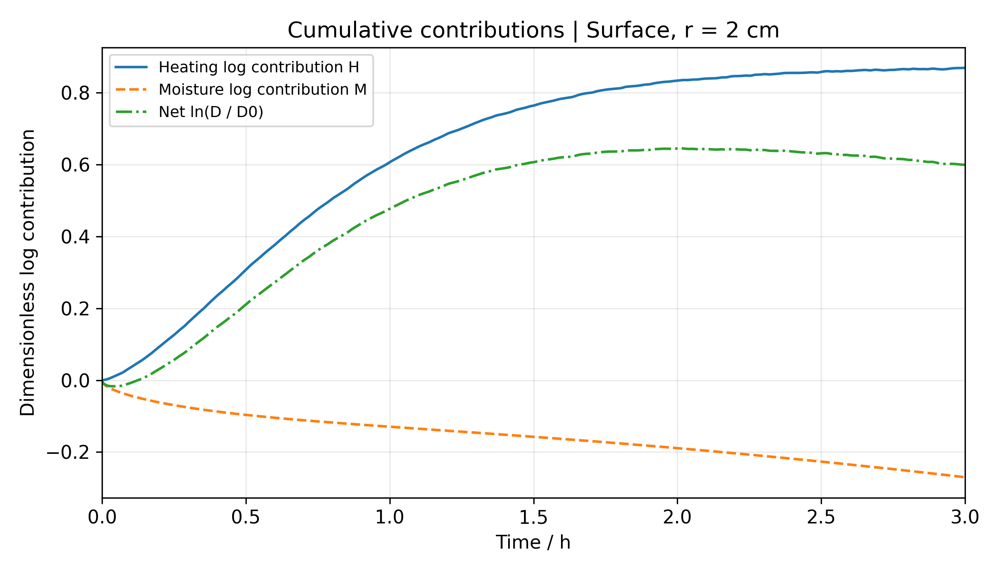
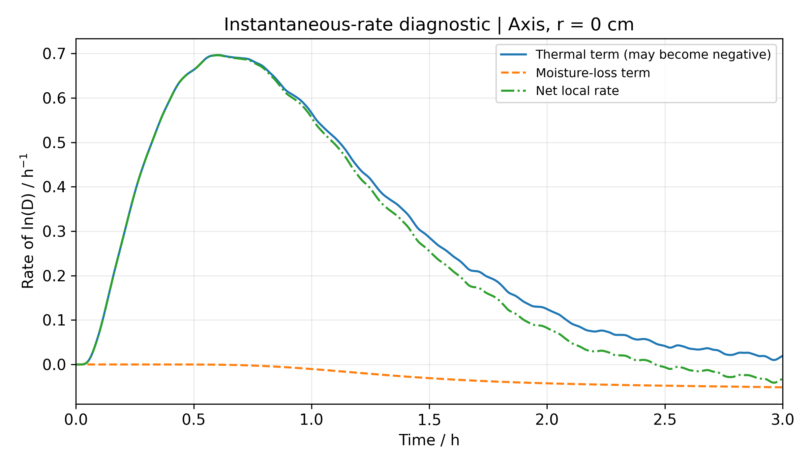
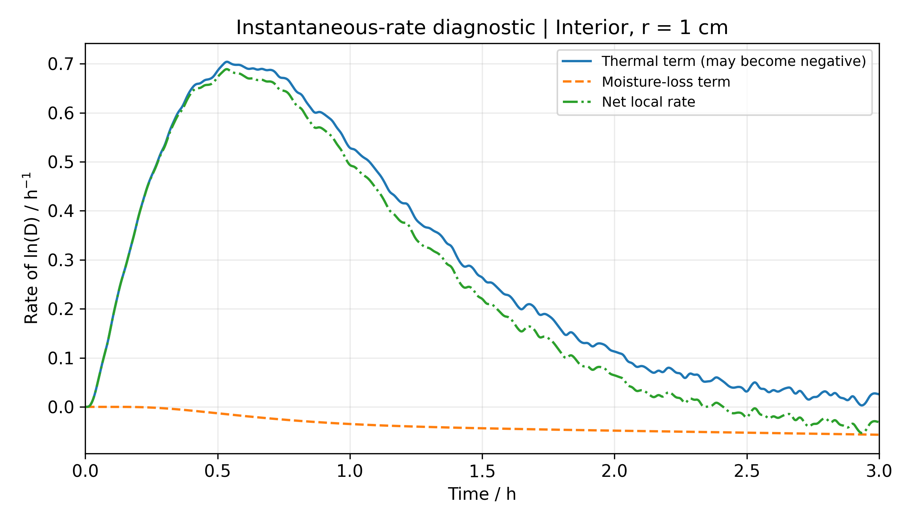
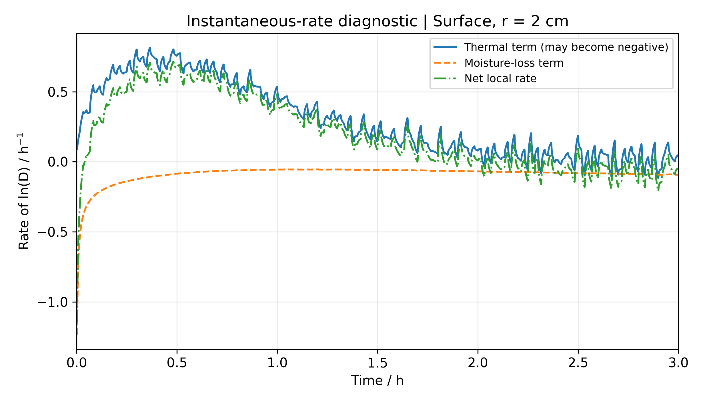
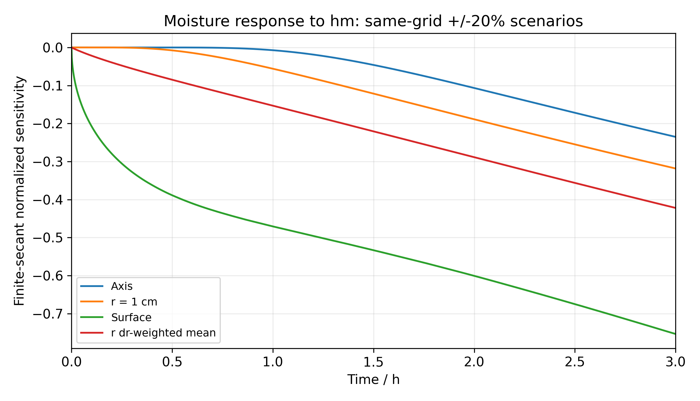
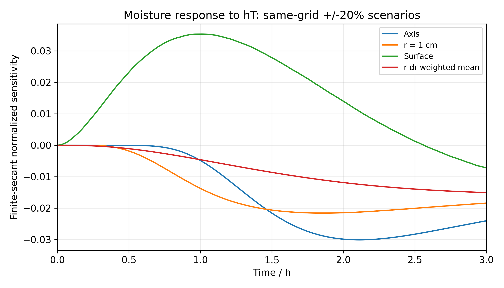
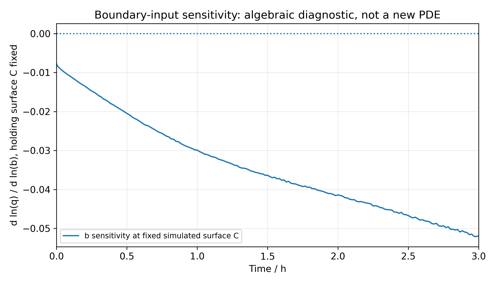

# 机制与不确定性分析

## 1. 数据身份和实际实施

本分析读取已验收的10801×21温度／含水率数组，包含初态；主分析选择轴心、1 cm和表面。参数灵敏度来自原Pro同一320区间网格的既有单因素情景，逐文件验证原清单SHA256后提取，并未重跑这些PDE或当作本地Radau重算数组。

文件 `data/mechanism_timeseries.csv` 保存三个位置全部每秒状态、D、H、M、导数和诊断标记，`data/mechanism_unrounded.npz`保留双精度。`reused/sensitivity_provenance.json`记录7份原数组的来源与哈希；本包保存其无插值的精确轨迹投影。

## 2. 累积贡献：严格恒等式，不是因果份额

由题给经验式，定义初始状态T₀=301.15 K、C₀=2.55，直接相减得到：

\[
\ln\frac{D(t,r)}{D_0}=H(t,r)+M(t,r),
\quad H=3850\left(\frac1{301.15}-\frac1{T_K}\right),
\quad M=0.45\left(\frac1{2.55}-\frac1C\right).
\]

三个位置全部采样点的重构最大绝对残差为 **2.803e-15**。这一检查验证代数分解和数值提取一致，不等于验证材料扩散率模型真实；H与M是沿实际耦合轨迹的对数贡献，不应换算成独立干预的因果百分比。

| 半径/cm | H(3h) | M(3h) | H+M | D(3h)/(m²/s) | D(3h)/D₀ |
|---:|---:|---:|---:|---:|---:|
| 0 | 0.864803 | -0.078317 | 0.786486 | 1.23872591e-08 | 2.195668 |
| 1 | 0.865730 | -0.110117 | 0.755613 | 1.20106622e-08 | 2.128916 |
| 2 | 0.869116 | -0.269903 | 0.599213 | 1.02717251e-08 | 1.820685 |

图1：D₀=5.64168037e-09 m²/s。表面早期失水较快，扩散率首先低于初值；之后升温促进作用累积增大，D上升。到较晚阶段，温度增幅缩小而含水率仍降低，D出现峰值后净回落，但并未回到初始水平。

| 半径/cm | 最低采样时刻/s | 最小D/D₀ | 最大采样时刻/s | 最大D/D₀ |
|---:|---:|---:|---:|---:|
| 0 | 0 | 1.000000 | 8856 | 2.219527 |
| 1 | 0 | 1.000000 | 8678 | 2.161264 |
| 2 | 144 | 0.983282 | 7262 | 1.905600 |

表面再次越过D₀约在449.31 s，是相邻每秒样点之间的线性定位，不是重新求解的精确事件时刻。表中的峰值也只表明已采样轨迹上的极值，不能据此宣称此后任何时刻都由同一机制占优。

图2—4：正的H表示相对初始温度的净促进，负的M表示相对初始含水率的净抑制。两者通过耦合方程相互影响；若冻结温度或含水率，轨迹自身也会改变，不能把本图当作那类反事实模拟的结果。

## 3. 瞬时竞争与稳健的有限时间增量

\[
\partial_t\ln D=G_T+G_C,
\qquad G_T=\frac{3850}{T_K^2}T_t,
\qquad G_C=\frac{0.45}{C^2}C_t.
\]

以1、2、5 s间距的五点四阶差分计算导数，不跨越环境60 s折点；折点取右侧格式，终点取左侧格式。初始0—9 s不作瞬时机制判定，保留原状态；差分产生的任何极小负含水率增量不解释为实质吸湿。

1与5 s导数方案在10 s以后最大总率差为3.276e-05 s⁻¹，在60 s以后为4.935e-06 s⁻¹。早期边界层的导数精度明显弱于状态精度，不能给它附加四位小数可靠性的主张。

脚本将绝对总率小于五倍步长方案差或1e-10 s⁻¹的点标为“符号未分辨”；该阈值是保守诊断，不是严格误差界。同时输出不依赖数值求导的60 s精确对数增量，作为发生小波动时的辅助判断依据。

表面响应会跟随环境的小幅波动，G_T可以变成负值；故不宜把温度项始终称为“升温促进”。2—3h内，三方案符号诊断给出的表面负总率采样比例约为75.6%，正总率约为23.0%，余下为未分辨或端点排除。

更稳健的阶段结论来自最后半小时增量：三个位置的H仍增加，但M下降幅度更大，所以D净下降。它不要求每一秒单调，也不受对某个极小导数作符号分类的影响，可作为论文中的主要机理解释。

| 半径/cm | ΔH，2.5—3h | ΔM，2.5—3h | D(3h)/D(2.5h)−1 |
|---:|---:|---:|---:|
| 0 | 0.014133 | -0.024802 | -1.0612% |
| 1 | 0.013333 | -0.027368 | -1.3937% |
| 2 | 0.011276 | -0.043382 | -3.1596% |

## 4. “水分主导”必须指定可检验的含义

3h时径向温差约0.1169 K，最冷点与当时空气温差约0.3455 K；径向含水率差仍约0.7581 kg/kg，有效水分积分还剩初始的54.2167%。这些支持“当前热响应接近均匀，而水分仍明显非均匀”。

它不直接证明所有后期状态都由同一种阻力控制，更不能从R²/D算出真实达标时间。“响应快慢”“达到阈值的瓶颈”“参数对指定输出的灵敏度”是不同命题；本轮只对前3h轨迹和已运行参数情景作判断。

## 5. 既有参数扰动的无量纲重表达

以p表示hₘ或hT，使用两端±20%情景定义中心割线量：

\[
E_{C,p}^{(20\%)}(t,r)=\frac{C_{1.2p}(t,r)-C_{0.8p}(t,r)}{0.4C_p(t,r)}.
\]

温度用升温幅度T−28 ℃归一化，避免以摄氏绝对数值作分母；升温不足0.05 K的点不报该比值，只保留绝对差。0.05 K是诊断屏蔽标准而非题给物理参数；所有情景按同网格基线比较，不混用Richardson解。

| 3h位置 | E(C,hₘ) | E(C,hT) | E(升温,hₘ) | E(升温,hT) |
|---|---:|---:|---:|---:|
| 轴心 | -0.235100 | -0.023994 | 0.002581 | 0.021379 |
| 1 cm | -0.318258 | -0.018379 | 0.002450 | 0.020010 |
| 表面 | -0.753442 | -0.007208 | 0.002121 | 0.016800 |
| r dr加权平均 | -0.421969 | -0.015038 | 0.002327 | 0.018893 |

hₘ对3h含水率的影响更强，但hT的±20%情景在整个3h内可使表面温度与同网格基线最多相差1.0981 K。不能只依据末时刻表面含水率对hT不敏感，推断换热过程在全时域都不重要。

PCHIP、冻结初始物性两份轨迹亦包含在投影文件中；本轮不额外拟合或重新运行。PCHIP差异沿用原验收记录，其外部输入重构误差不等于物性不确定性。这里没有给概率分布、蒙特卡洛区间或参数“最优值”。

## 6. 映射小扰动诊断不是识别结果

固定状态时q̂=hₘ(C_s−b)，对b的局部对数导数为−b/(C_s−b)，初始约-0.007758，3h约-0.051933。这只说明在当前恒等映射附近的小相对扰动瞬时效应有限，不约束未知映射的真实偏离。

当C_s接近b时，该比值可能很大，改变b还会改变长期平衡；改变hₘ则主要改变接近平衡的速率。不能将“前3h局部小扰动灵敏度较弱”当作环境量已正确映射为药材平衡含水率的证据。

## 7. 数据与复现

运行 `python source/q2_mechanism.py` 可用本包内已有数组重新生成上述全部图、表和源数据，不需要访问网络，不调用任何PDE求解器。CSV除有明确屏蔽规则的温度归一化列外均为有限数值；未舍入值同时保留NPZ格式。

图题采用英文位置、时间和SI单位，正文图注明确空间口径；每张图独立绘制，无手选颜色。文件总索引见 `figures/manifest.json`；半小时表只为机制分析，不替换题目原有两张论文结果表。
